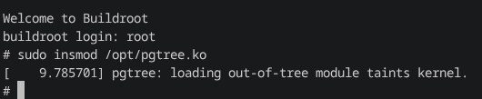
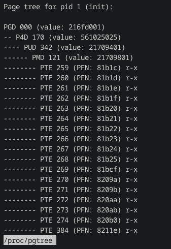
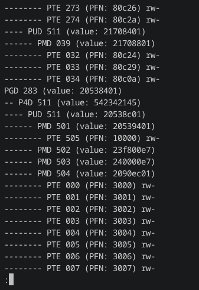
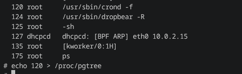
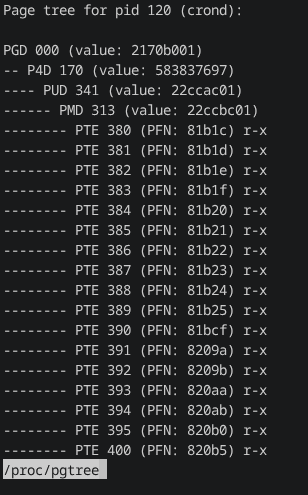
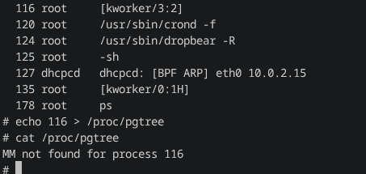

# edu-practice-riscv-task2
Практика по курсу riscv, задание 2

## Устройство
Создаю ядерный модуль `pgtree`. При инициализации он создает файл `/proc/pgtree`, поддерживающий запись и чтение:
- Запись: `echo <pid> > /proc/pgtree` меняет запомненный им pid.
- Чтение: `less /proc/pgtree` начнет иерархически выводить все страницы процесса с pid, который мы записали ранее, в виде дерева. По умолчанию pid=1.

Основная функция `print_pgtree` просто выводит страницы по уровням: PGD -> P4D -> PUD -> PMD -> PTE. Для всех уровней кроме последнего выводит номер у родителя и значение value, для PTE выводит PFN и права доступа. Невалидные страницы пропускаются, ранние листья выводятся и пропускаются.

## Сборка
Для того чтобы собрать модуль, нужно, имея в той же директории собранные вещи для кросс-компиляции:
- `./config.sh` для установки переменных
- `make KDIR=$KDIR ARCH=$ARCH CROSS_COMPILE=$CROSS_COMPILE` для сборки
- Получился модуль `pgtree.ko`, который потом можно установить с помощью `insmod`.

## Пример взаимодействия

Запускаем линукс и устанавливаем модуль:

Пробуем прочитать этот файл сходу:

Видим что у нас получилось замечательное дерево! Вот еще скрин:

Теперь меняем процесс:

И видим такое же дерево для процесса crond:

А если попробовать закинуть ядерный процесс?

У этого процесса нет MM потому что он ядерный.

## Резюме
Добавил ядерный модуль, который добавляет виртуальный файл, в который можно писать pid, и затем читать из него иерархическое дерево таблиц валидных страниц процесса, с их адресами и правами доступа.